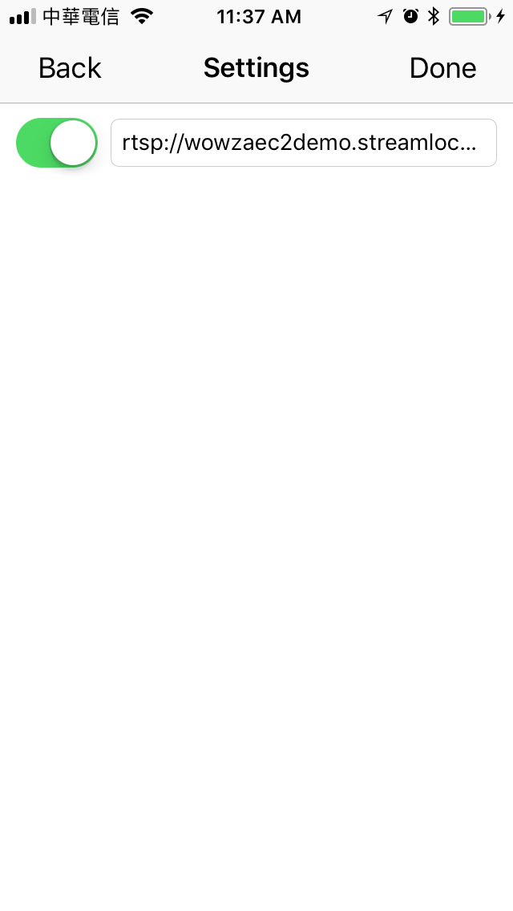
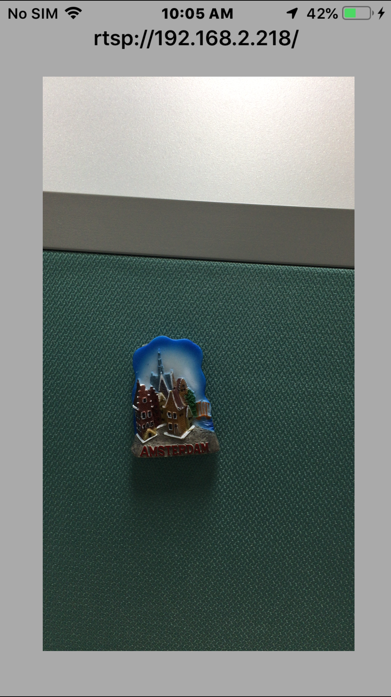
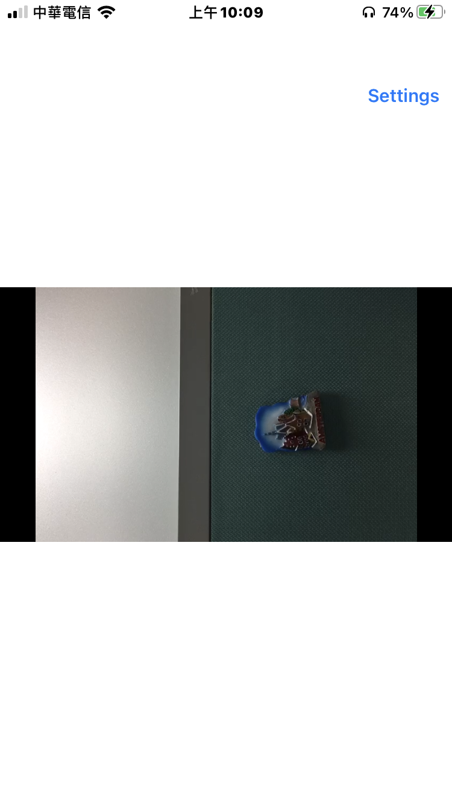

# IRIPCamera 

- IRIPCamera is a powerful URL/Rtsp/IPCam player/viewer for iOS.

## How it works?
- Basically, it works by `IRPlayer` + `Live555` + iOS Native API.
    - [IRPlayer](https://github.com/irons163/IRPlayer)
    - [Live555](http://www.live555.com/)
- `Live555` can make a connection with a rtsp server/streaming.
- Decoding the frames by iOS VideoToolbox. The pixel format is NV12.
- `IRPlayer` is the video player which can receive the frames and play it.
    - If you are interested in this part, you can see how it works in `IRFFVideoInput`.
- Playing the audio by iOS AudioToolbox.

## Features
- Support Rtsp streaming.
- Support for customize connection to your streaming device or IPCam.
- Provide a demo that using `H264-RTSP-Server-iOS` as a RTSP IPCamera and `IRIPCamera` as a RTSP Player.
    - See [H264-RTSP-Server-iOS](https://github.com/irons163/H264-RTSP-Server-iOS).

## How the demo works?
- Prepare 2 iPhones, connecting them in the same network.
- Run [H264-RTSP-Server-iOS](https://github.com/irons163/H264-RTSP-Server-iOS) in an iPhone, it would show the local IP in the top of the screen.
- Run this project in the other iPhone, type the RTSP Url into the setting page.
- Enjoy your personal iPhoneCam : )

## Future
- Support Multi viewer.
- More powerful custom settings.

## Install
### Git
- Git clone this project.

### Cocoapods
- Not support yet.

## Usage

### Basic
- Goto `Setting` Page, then type the URL in the textfield.
    - EX: `rtsp://192.168.2.218`
- OR, you can simply just type `demo` in the textfiled, if you want to use the demo rtsp url.
  - Full Demo RTSP URL: `rtsp://wowzaec2demo.streamlock.net/vod/mp4:BigBuckBunny_115k.mov`
- Pressing `Done` button, then the program will try to connect and play it.

### Advanced settings
- Make your custom network connector.
```obj-c
@interface IRCustomStreamConnector : IRStreamConnector
@end
```

- Make your custom network request.
```obj-c
@interface IRCustomStreamConnectionRequest : IRStreamConnectionRequest
@end
```

- Make your custome network response.
```obj-c
@interface IRCustomConnectionResponse : IRStreamConnectionResponse
@end
```

- There are already some codes for custome network connection like IP Cam in this project.
See how the `IRCustomStreamConnector` + `IRCustomStreamConnectionRequest` + `IRStreamConnectionResponse` + `DeviceClass` work.
- The codes for how you connection your IP Cam are not implement(Login, Query, etc...). You need to customize it.

## Screenshots
|Display|Setting|
|---|---|
|||
|||
